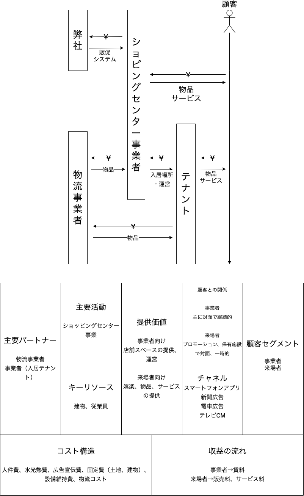

# 正しいものを正しく作る塾 設計コース第2回課題

# PICT図解,ビジネスモデルキャンバス

ショッピングセンター事業を扱っているため図解しました。テナント、物流事業者とは共存関係にあると捉えられる。
また、テナントに対しては不動産事業のような側面もある。

# 知識豊富な設計のbefore/after

- 「ある貨物が航海で輸送できるかどうか」という概念に名前が付けられたことで、他人とのメンタルモデルを一致させやすくなった
- オーバーブッキングポリシーという概念に切り出したため、取り回しが良くなり再利用がしやすくなった。
- 積載できるかどうかをクラスに閉じ込めたため、検索容易性、変更容易性があがった。

# 航空会社のオーバーブッキング

コトラーの競争地位戦略的に、上位の企業になればなるほど、オーバーブッキングの発生件数が少なく、また発生した場合の補填対応が手厚くなると考えられる。  
そうすることでサービスの質を高め、ブランドイメージの低下を防ぐような方法を採用すると思われる。
より下位の企業では薄利多売方式を採用しやすいと考えられ、オーバーブッキング発生時の保証が薄い代わりに運賃を低くするといった戦略を取ると思われる。
